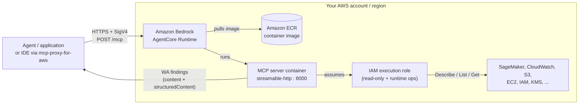

# SageMaker Well-Architected MCP Server — AgentCore Deployment Guide

This guide covers deploying the SageMaker Well-Architected MCP server to
Amazon Bedrock AgentCore Runtime, so it runs as a hosted, network-reachable
service instead of a local process.

For running the server locally with an IDE (Kiro, Cursor, VS Code), see the
[main README](README.md) — that path is unchanged and does not require
anything in this guide.

## Reference architecture



1. A caller signs each MCP request with SigV4 and POSTs to the runtime's
   `/mcp` endpoint.
2. AgentCore Runtime runs the server container (image stored in Amazon ECR).
3. The container serves MCP over streamable-HTTP on port 8000.
4. It assumes the runtime's execution role — the read-only application
   permissions plus the operational permissions the runtime needs (see
   [Security Best Practices](#security-best-practices)).
5. It calls SageMaker and related services with Describe / List / Get only.
6. Well-Architected findings return to the caller.

This architecture applies only to the hosted AgentCore path. Running locally
(the [main README](README.md) quickstart) has no equivalent — your IDE spawns
the server as a subprocess and it calls AWS with your local credentials.

## Local MCP vs. AgentCore Runtime — which do you need?

| | Local MCP (stdio) | AgentCore Runtime (this guide) |
|---|---|---|
| **Where it runs** | Spawned as a subprocess on your machine by your IDE | A managed container hosted by AWS, reachable over the network |
| **Who can use it** | Only you, on that machine | Any authenticated caller with network access to the endpoint |
| **AWS credentials** | Your local `~/.aws/credentials` / `AWS_PROFILE` | An IAM execution role attached to the runtime — no local credentials needed by callers |
| **Setup** | `uvx awslabs.sagemaker-wa-mcp-server` in your IDE's MCP config | Build a container, deploy an AgentCore Runtime resource (this guide) |
| **Best for** | Individual development, ad hoc validation | Shared/team access, no per-user AWS CLI setup, integration into a hosted agent |

If you only need the tools in your own IDE, use the [main README](README.md)
quickstart and stop here. Continue below only if you need the server
reachable over the network by other callers.

## Overview

The repository ships two deployment artifacts for this path:

* **`Dockerfile`** (repo root) — builds the MCP server as an ARM64 container
  that runs with `--transport streamable-http`, satisfying AgentCore
  Runtime's [MCP protocol contract](https://docs.aws.amazon.com/bedrock-agentcore/latest/devguide/runtime-mcp-protocol-contract.html):
  the container must listen on `0.0.0.0:8000` and expose `POST /mcp`.
  AgentCore Runtime requires ARM64 images; on an x86/Intel machine this
  build runs under emulation and is slower.
* **`cdk/`** — an AWS CDK (Python) app that builds that Dockerfile as a CDK
  asset, creates a scoped IAM execution role, and deploys the AgentCore
  Runtime resource. This is the recommended path for a repeatable,
  version-controlled deployment.

## Security Best Practices

### Least privilege execution role

The CDK stack in this repo defines an execution role whose **application
permissions are read-only** — scoped to the `Describe`/`List`/`Get` actions
the validators call, matching
[`awslabs/sagemaker_wa_mcp_server/README.md`](awslabs/sagemaker_wa_mcp_server/README.md)'s
"AWS Services Used" table. It does **not** attach `ReadOnlyAccess` or any
broader managed policy. The runtime also needs a few operational
permissions to run (logs, metrics, image pull) — the construct adds those
automatically; see "Permissions the runtime adds automatically" below. If
you customize the execution role, start from this scoped policy rather than
widening it.

Most of the statements use `Resource: "*"` because the underlying IAM
actions (`sagemaker:ListEndpoints`, `cloudwatch:ListMetrics`,
`sts:GetCallerIdentity`, etc.) are account/region-level list-and-describe
operations that do not support resource-level ARN scoping — this is a
property of those AWS APIs, not a shortcut taken in this template.

### Authentication

By default, this stack omits `authorizerConfiguration`, so the runtime uses
**IAM (SigV4) authentication** — the default when unset. Callers must sign
requests with valid AWS credentials that are authorized to invoke the
runtime; the endpoint URL itself is not a secret. If you need callers
without AWS credentials (e.g., a third-party client), configure Cognito or
JWT authentication instead — see the
[`aws_bedrockagentcore` CDK construct reference](https://docs.aws.amazon.com/cdk/api/v2/docs/aws-cdk-lib.aws_bedrockagentcore-readme.html#runtime-authentication-configuration)
for `RuntimeAuthorizerConfiguration.using_cognito()` / `.using_jwt()`.

### Network mode

The stack deploys in `PUBLIC` network mode (the AgentCore default) — the
runtime endpoint is internet-reachable but authentication-gated. For
workloads requiring network isolation, AgentCore Runtime also supports VPC
mode; see the CDK construct reference's "Runtime Network Configuration"
section.

### Credential separation

The execution role is completely separate from any local AWS credentials.
All AWS API calls the deployed server makes use the execution role you
specify — never credentials from whoever is calling the runtime.

### Permissions the runtime adds automatically

Beyond the read-only statements this template defines, the
`agentcore.Runtime` construct attaches the operational permissions the
runtime needs to run. The construct adds these itself (they are not in this
template), and they are scoped, not blanket:

* **CloudWatch Logs** — create and write the runtime's own log group and
  log streams
* **X-Ray** — send trace segments
* **CloudWatch metrics** — `cloudwatch:PutMetricData`, restricted to the
  `bedrock-agentcore` metric namespace
* **ECR** — pull the runtime's container image
* **Bedrock AgentCore workload identity** — obtain the runtime's
  workload-identity token

If you replace the execution role with your own, keep these — the runtime
will not start or emit logs and metrics without them.

### Scoping access per team or environment

Every caller that successfully authenticates against a deployed runtime
shares that runtime's execution role and AWS permissions. If different
teams or environments need different AWS access, deploy separate stacks
(each with its own execution role) rather than sharing one runtime across
them.

## Prerequisites

* An AWS account with permissions to create IAM roles, ECR repositories,
  and Bedrock AgentCore resources
* **AWS CDK Toolkit (CLI) v2 — 2.1141.0 or newer.** Check with
  `cdk --version`. This guide was validated with CLI 2.1141.0 and
  `aws-cdk-lib` 2.269.0; an older CLI fails `cdk bootstrap`/`cdk deploy`
  with a "Cloud assembly schema version mismatch" error. Upgrade with
  `npm install -g aws-cdk@latest`, or run each command through
  `npx aws-cdk@latest <command>` (use `npx` if a root-owned global npm
  prefix makes `npm install -g` fail with an `EACCES` permission error).
* Python 3.10+ and `pip`
* Docker, or a Docker-compatible builder (Colima, Finch, Podman) — CDK uses
  it to build the container image as part of `cdk deploy`. If your builder
  is not the `docker` command (for example Finch), point CDK at it with
  `export CDK_DOCKER=finch`.
* AWS credentials configured locally (e.g. via `aws configure` or your
  organization's credential process) with permissions to deploy the stack

## Test the container locally (optional)

Before deploying, you can confirm the image builds and serves MCP on your
own machine:

```bash
docker build -t sagemaker-wa-mcp .
docker run --rm -d --name smwa -p 8000:8000 sagemaker-wa-mcp

# Expect an SSE 'data:' line whose result.serverInfo.name is
# awslabs.sagemaker-wa-mcp-server:
curl -s -X POST http://localhost:8000/mcp \
  -H 'Content-Type: application/json' \
  -H 'Accept: application/json, text/event-stream' \
  -d '{"jsonrpc":"2.0","id":1,"method":"initialize","params":{"protocolVersion":"2025-06-18","capabilities":{},"clientInfo":{"name":"curl","version":"1"}}}'

docker stop smwa
```

## Deploy

The steps in this section are for the AgentCore path only — local IDE users
need none of them.

Choose the region first. The stack does not hard-code a region, so CDK
deploys to whatever your environment resolves (`AWS_REGION`, otherwise your
profile's region). Bootstrap and deploy **must target the same region**, and
that region must support AgentCore Runtime — see
[AgentCore supported Regions](https://docs.aws.amazon.com/bedrock-agentcore/latest/devguide/agentcore-regions.html).

```bash
cd cdk

# Install the CDK library into an isolated virtualenv so it doesn't change
# your global Python packages:
python3 -m venv .venv
source .venv/bin/activate
pip install -r requirements.txt

# Confirm which account and region you're pointed at:
aws sts get-caller-identity

# One-time per account/region — use the SAME region you deploy to:
cdk bootstrap aws://ACCOUNT_ID/REGION

# Review the IAM changes CDK will make, then deploy:
cdk diff
cdk deploy
```

`cdk deploy` pauses to ask you to approve the IAM changes it creates; in a
non-interactive shell (e.g. CI) add `--require-approval never`.

`cdk deploy` builds the repo's `Dockerfile` as a CDK asset, pushes it to a
CDK-managed ECR repository, creates the scoped execution role, and creates
the AgentCore Runtime. On success, it prints the deployed runtime's ARN as
a stack output:

```
Outputs:
SageMakerWaMcpAgentCoreStack.AgentRuntimeArn = arn:aws:bedrock-agentcore:REGION:ACCOUNT_ID:runtime/sagemakerWaMcpServer-XXXXXXXXXX
```

## Verify the deployment

The runtime ID is the part of the ARN after `runtime/` (for example
`sagemakerWaMcpServer-XXXXXXXXXX`). Confirm it reached `READY`:

```bash
aws bedrock-agentcore-control get-agent-runtime \
  --agent-runtime-id sagemakerWaMcpServer-XXXXXXXXXX \
  --region REGION \
  --query status --output text
```

Expected output: `READY`.

## Invoke the deployed server

The runtime is invoked over streamable-HTTP at:

```
https://bedrock-agentcore.{region}.amazonaws.com/runtimes/{url-encoded-arn}/invocations?qualifier=DEFAULT
```

URL-encode the ARN by replacing `:` with `%3A` and `/` with `%2F`.

With IAM authentication (this stack's default), every request must be
signed with SigV4 using the `bedrock-agentcore` service name; there is no
separate bearer token to manage. The script below signs each request, runs
the full MCP sequence (`initialize` → `notifications/initialized` →
`tools/list` → `tools/call`), and parses the streamable-HTTP (SSE)
responses. It needs `boto3` and `httpx` (`pip install boto3 httpx`) and
your local AWS credentials.

```python
import json
import boto3
import httpx
from botocore.auth import SigV4Auth
from botocore.awsrequest import AWSRequest

# Runtime ARN from `cdk deploy`, URL-encoded (: -> %3A, / -> %2F):
URL = 'https://bedrock-agentcore.REGION.amazonaws.com/runtimes/YOUR_ENCODED_ARN/invocations?qualifier=DEFAULT'
REGION = 'REGION'
credentials = boto3.Session().get_credentials()


def call(method, params=None, session_id=None, notify=False):
    body = {'jsonrpc': '2.0', 'method': method}
    if not notify:
        body['id'] = 1
    if params is not None:
        body['params'] = params
    data = json.dumps(body)

    headers = {
        'Content-Type': 'application/json',
        'Accept': 'application/json, text/event-stream',
    }
    if session_id:
        headers['Mcp-Session-Id'] = session_id

    # Sign with SigV4, then send the signed headers with httpx:
    signed = AWSRequest(method='POST', url=URL, data=data, headers=headers)
    SigV4Auth(credentials, 'bedrock-agentcore', REGION).add_auth(signed)
    resp = httpx.post(URL, headers=dict(signed.headers), content=data, timeout=60)

    # Responses come back as SSE; return the first JSON 'data:' payload.
    for line in resp.text.splitlines():
        if line.startswith('data:'):
            return resp, json.loads(line[len('data:'):].strip())
    return resp, None


# 1. Handshake. In stateless mode the server may not return a session id;
#    if it does, echo it back on later requests for microVM stickiness.
resp, _ = call('initialize', {
    'protocolVersion': '2025-06-18',
    'capabilities': {},
    'clientInfo': {'name': 'client', 'version': '1'},
})
session_id = resp.headers.get('mcp-session-id')

call('notifications/initialized', session_id=session_id, notify=True)

# 2. List tools.
_, tools = call('tools/list', session_id=session_id)
print([t['name'] for t in tools['result']['tools']])

# 3. Call a tool.
_, out = call('tools/call', {
    'name': 'get_pillar_details',
    'arguments': {'pillar': 'security'},
}, session_id=session_id)
print(out['result']['content'][0]['text'])
```

See
[MCP session management](https://docs.aws.amazon.com/bedrock-agentcore/latest/devguide/runtime-mcp-protocol-contract.html#mcp-session-management-and-microvm-stickiness)
for how AgentCore uses `Mcp-Session-Id` for microVM stickiness.

## Connect an IDE to the deployed server

You can point Kiro, Cursor, or VS Code at the deployed runtime instead of
running the server locally. Since these clients don't sign SigV4 requests
natively, configure them to launch
[`mcp-proxy-for-aws-cli`](https://github.com/aws/mcp-proxy-for-aws), a
small local proxy that signs each request with your local AWS credentials
and forwards it to the runtime. The client still launches a local process
(same as the local Quickstart), but that process talks to the remote
runtime instead of running the SageMaker WA MCP server itself.

Replace `YOUR_ENCODED_ARN` with the runtime ARN from [Deploy](#deploy),
URL-encoded as described in [Invoke the deployed server](#invoke-the-deployed-server).

**For Mac/Linux:**

```json
{
  "mcpServers": {
    "awslabs.sagemaker-wa-mcp-server": {
      "command": "uvx",
      "args": [
        "mcp-proxy-for-aws-cli@latest",
        "https://bedrock-agentcore.REGION.amazonaws.com/runtimes/YOUR_ENCODED_ARN/invocations?qualifier=DEFAULT",
        "--service",
        "bedrock-agentcore",
        "--region",
        "REGION"
      ]
    }
  }
}
```

**For Windows:**

```json
{
  "mcpServers": {
    "awslabs.sagemaker-wa-mcp-server": {
      "command": "uvx",
      "args": [
        "--from",
        "mcp-proxy-for-aws-cli@latest",
        "mcp-proxy-for-aws-cli.exe",
        "https://bedrock-agentcore.REGION.amazonaws.com/runtimes/YOUR_ENCODED_ARN/invocations?qualifier=DEFAULT",
        "--service",
        "bedrock-agentcore",
        "--region",
        "REGION"
      ]
    }
  }
}
```

The proxy uses your local AWS credentials (the same `AWS_PROFILE`/
`AWS_REGION` resolution as the local Quickstart) to sign requests — the
deployed server itself still runs under its own execution role; your local
credentials only need permission to invoke the AgentCore runtime, not to
call SageMaker/CloudWatch/etc. directly.

Through the proxy, the server reports itself as `MCP Proxy for AWS` in its
`serverInfo` — that is the proxy identifying itself, not a misconfiguration.

## Troubleshooting

**Tools not appearing / `AccessDenied` on tool calls** — check the
execution role's attached policy matches the services the resource you're
validating actually needs; see
[`awslabs/sagemaker_wa_mcp_server/README.md`](awslabs/sagemaker_wa_mcp_server/README.md)'s
service table. Use CloudTrail to confirm which role executed a given API
call.

**Connection refused / handshake fails** — confirm the runtime status is
`READY` (see Verify the deployment above), and that your request includes
a correctly URL-encoded runtime ARN and valid SigV4 signing.

## Clean up

Remove the AgentCore Runtime and its execution role:

```bash
cd cdk
cdk destroy
```

`cdk destroy` does not remove the CDK bootstrap stack (`CDKToolkit`) or the
container images CDK pushed to its ECR asset repository. Delete those
separately if you want a full teardown.
